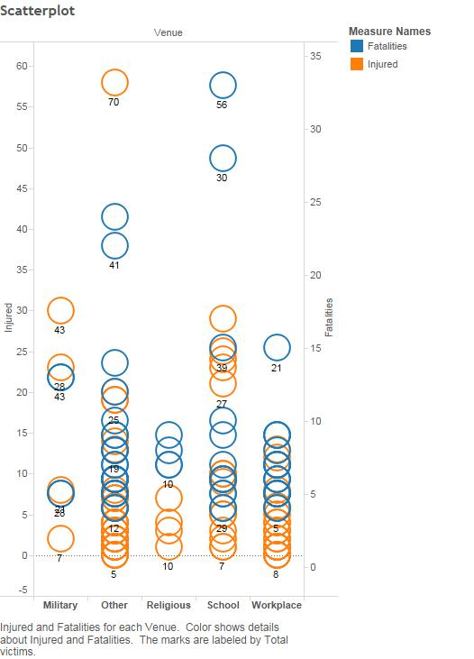
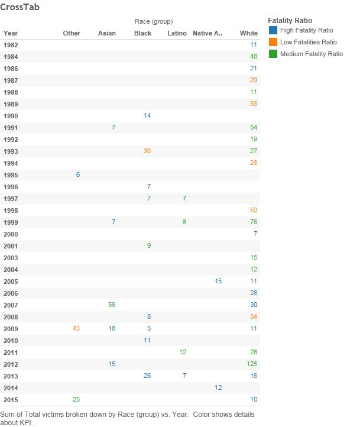
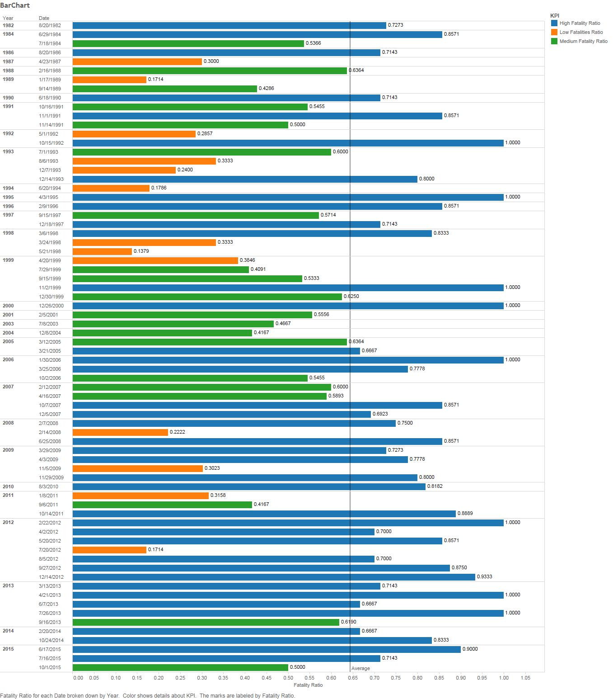

Mass Shooting
=============

```{r}
source("C:/Users/Chris/Desktop/DataVisualization/DV_TProject1/01 Data/shootingsmassETL.R", echo = TRUE)
```

```{r}
source("C:/Users/Chris/Desktop/DataVisualization/DV_TProject1/01 Data/shootingsmassData.R", echo = TRUE)
```

###Scatter Plot

'''
This plot shows the number of injured victims and fatalities given set venue along with the label of total number of victims on that instance written in the text. We can observe that for almost every venue the number of fatalities outnumbers the number of injuries with the exception of the military venue type. 

We found really interesting that our data supports that one of the place that had the most gun presence is portrayed as one of the safest places during a mass shooting.
'''



###Crosstab

'''
This crosstab demonstrates the distribution of total victims based of the perpetrators’ races through the years from 1982 to 2015. The color indicates the percentage of victims that became fatalities. An observation that can be made is the slow increase in other races presence in these visualizations in contrast to the predominant white perpetrators.

We found interesting that how this correlates with the decrease in prejudice in minorities groups, and the increase diversity of the perpetrators shootings.
'''



###Bar Chart
'''
This barchart displays each incident per year since 1982. Each bar is labeled with the fatality rate for the specific incident and is colored based on the Fatality KPI which relates each incident to a Low Fatality rate, a Medium Fatality rate, or a High Fatality rate.The barchart also displays a reference line that is placed at the average fatality rate for all incidents. This barchart is interesting because it depicts and compares the severity of each incident. This barchart tells us that in the most recent years (since 2009),the amount of incidents with an above average fatality rate has been greater than the incidents from 1982-2009.
'''




